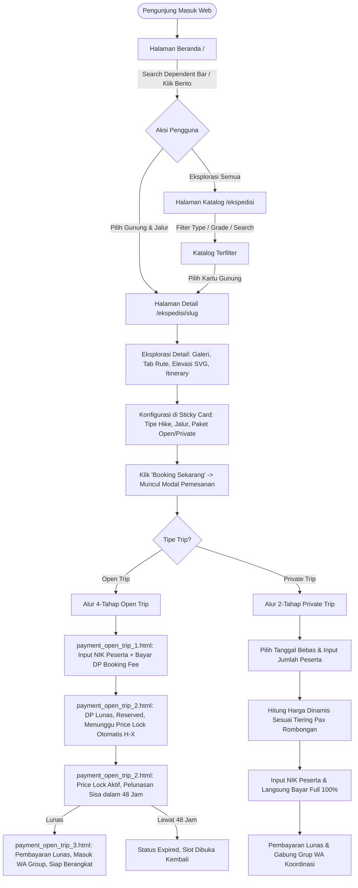

# Product Requirements Document (PRD) & Overall System Guide
# MiddleTrip — Platform Ekspedisi & Pendakian Gunung Indonesia

> **Versi Dokumen:** 1.1.0  
> **Status:** Living Document / Active Architecture Reference  
> **Target Audiens:** AI Coding Agents, Software Engineers, UI/UX Designers, Product Managers  
> **Repositori:** MiddleTrip (Laravel 13 • PHP 8.5 • Docker Sail • Tailwind CSS v4 • Alpine.js)

---

## 1. Executive Summary & Visi Produk

### 1.1 Visi
**"Jalan Tengah Menuju Puncak yang Sesungguhnya"**  
MiddleTrip hadir sebagai platform ekspedisi pendakian gunung digital di Indonesia yang memecahkan masalah klasik industri *open trip* dan pemanduan alam bebas: ketidakpastian kuota, ketertutupan skema harga, ketiadaan standarisasi teknis jalur, serta kerumitan birokrasi perizinan (SIMAKSI).

### 1.2 Nilai Inti Platform (Core Value Proposition)
1. **Standarisasi Jalur Pendakian (*Chromatic Grade Hierarchy*)**:
   - 🟢 **Grade A (Pemula / Beginner)**: Jalur landai, akses air melimpah, elevasi bersahabat (contoh: Merbabu via Selo, Prau via Dieng).
   - 🟠 **Grade B (Menengah / Intermediate)**: Jalur terjal, medan berbatu/vulkanik, jarak tempuh sedang (contoh: Sindoro via Kledung, Sumbing).
   - 🔴 **Grade C (Ahli & Ekstrem / Expert)**: Medan teknis, punggungan sempit, elevasi tinggi & cuaca ekstrem (contoh: Raung, Rinjani via Torean).
2. **Dynamic Pricing Berbasis Skala Peserta**: Semakin banyak peserta yang bergabung dalam satu batch open trip, semakin murah harga per pax bagi seluruh peserta.
3. **Pemesanan Transparan 4-Tahap (*4-Stage Booking Lifecycle*)**: Memisahkan komitmen awal (Booking Fee DP) dengan pelunasan harga akhir setelah kuota terkunci (*Price Lock*).
4. **Kepastian Berangkat (*Unconditional Departure*)**: Tidak ada batas minimal keberangkatan; trip tetap berangkat meskipun hanya 1 peserta yang terdaftar di batch tersebut.

---

## 2. Aktor & Peran Pengguna (User Roles)

| Peran | Deskripsi | Akses & Wewenang |
|---|---|---|
| **Guest / Pendaki Umum** | Pengunjung umum yang mencari informasi ekspedisi gunung. | Akses Home, pencarian rute, katalog ekspedisi, melihat detail gunung, profil elevasi SVG, dan itinerary. |
| **Registered Customer (Pendaki)** | User terautentikasi yang melakukan reservasi trip. | Mengisi form pemesanan (Nama & NIK), membayar DP/Pelunasan, melihat riwayat booking di Dashboard, bergabung grup WhatsApp trip. |
| **Admin / Expedition Operator** | Tim operasional MiddleTrip yang mengelola ekspedisi. | Menentukan master data gunung, jalur, matriks harga bertingkat (*Price Tiers*), nilai Booking Fee per gunung, jadwal H-X *Price Lock*, dan verifikasi pembayaran. |

---

## 3. Peta Arsitektur Sistem & Status Implementasi Saat Ini

### 3.1 Status Modul Aplikasi (As-Is vs To-Be)

| Modul / Halaman | Route URL | Controller & Views | Status Implementasi |
|---|---|---|---|
| **Landing Page** | `GET /` | `HomeController@index` $\rightarrow$ `home.blade.php` | ✅ **Selesai (Live)**. Hero header, Search Bar Dependent Dropdown (Gunung $\rightarrow$ Jalur $\rightarrow$ Grade), Bento Grid Unggulan, Value Props, Testimoni. |
| **Katalog Ekspedisi** | `GET /ekspedisi` | `ExpeditionController@index` $\rightarrow$ `customer/shop.blade.php` | ✅ **Selesai (Live)**. Filter Pill (Semua/Open/Private), Dropdown Grade, Search input, Responsive Grid Card Gunung. |
| **Detail Ekspedisi** | `GET /ekspedisi/{slug}` | `ExpeditionController@show` $\rightarrow$ `customer/detail.blade.php` | 🟡 **UI Siap (Mock Data)**. UI lengkap: Gallery Grid + Lightbox, Route Switcher (Via), Profil Elevasi SVG interaktif, Timeline 2D1N, Fasilitas Include/Exclude, Sticky Booking Card. |
| **Modal Pemesanan** | Dynamic in `#bookingModal` | `customer/detail.blade.php` (Alpine.js) | 🟡 **UI Prototipe Siap**. Pax stepper (1-10), pilihan Meeting Point (Shuttle), Add-ons sewa alat, kalkulasi harga realtime. |
| **Checkout Step 1 (Data & DP)** | `GET /checkout/{booking_code}` | `BookingCheckoutController@showStep1` $\rightarrow$ `payment_open_trip_1.html` | 🟡 **Desain UI Siap**. Data Pemesan, Detail NIK Anggota, Rincian DP Booking Fee, Pilihan Metode Bayar (VA/QRIS). |
| **Checkout Step 2 (Price Lock)** | `GET /checkout/{booking_code}/status` | `BookingCheckoutController@showStep2` $\rightarrow$ `payment_open_trip_2.html` | 🟡 **Desain UI Siap**. Banner Booking Berhasil, Status DP Lunas, Info Kuota Peserta Terkumpul, Countdown Pelunasan H-X. |
| **Checkout Step 3 (Lunas / Selesai)** | `GET /checkout/{booking_code}/success` | `BookingCheckoutController@showStep3` $\rightarrow$ `payment_open_trip_3.html` | 🟡 **Desain UI Siap**. Stepper 4 Tahap Hijau Selesai, Invoice Pelunasan, Link Gabung Grup WhatsApp, Unduh E-Tiket. |
| **Private Trip Checkout** | `GET /checkout/private/{booking_code}` | `BookingCheckoutController@showPrivate` (Adaptasi Step 1 & 3) | 🟡 **Rancangan Siap**. Stepper 2-Tahap (Data $\rightarrow$ Pay 100% $\rightarrow$ Sukses). |
| **Automated Price Lock** | Artisan CLI Command | `php artisan expeditions:process-price-locks` | ⏳ **Next Milestone**. Cron harian mengunci harga batch H-X sebelum keberangkatan dan menghitung sisa pelunasan. |
| **Admin Panel** | `/admin/**` | `Admin\MountainController`, dll | ⏳ **Next Milestone**. Manajemen gunung, setting booking fee, price tiers, dan jadwal ekspedisi. |

---

## 4. Alur Pengguna Menyeluruh (End-to-End User Journey)

### 4.1 Diagram Alur Global

---

## 5. Spesifikasi Detail Logika Bisnis (Business Logic Rules)

### 5.1 Pricing Matrix & Dynamic Tiering (`expedition_price_tiers`)
Harga ekspedisi bersifat dinamis berbanding terbalik dengan jumlah peserta:
* Admin menentukan tabel berundak per gunung:
  * Rentang 1 (contoh: 1–3 orang): Rp 650.000 / pax
  * Rentang 2 (contoh: 4–6 orang): Rp 550.000 / pax
  * Rentang 3 (contoh: 7–10 orang): Rp 480.000 / pax
* **Open Trip**: Menggunakan total akumulasi seluruh peserta yang mendaftar pada batch yang sama saat batas waktu *Price Lock* tiba.
* **Private Trip**: Langsung menggunakan tier berdasarkan jumlah peserta yang dipesan oleh rombongan tersebut saat pemesanan dibuat.

### 5.2 Alur Pemesanan 4 Tahap Open Trip (Sesuai Referensi UI Payment)

#### 1. Tahap 1: DATA & RESERVASI (`payment_open_trip_1.html`)
* **Stepper UI**: `Data` (Done) $\rightarrow$ `Reservasi` (Active) $\rightarrow$ `Price Lock` (Dotted) $\rightarrow$ `Pay` (Dotted).
* **Konten**:
  * Informasi Trip (Destinasi, Rute, Meeting Point, Keberangkatan).
  * Tabel Harga Saat Ini (Peserta saat ini, Harga berikutnya, Nilai Booking Fee DP per orang).
  * Data Pemesan (Nama Lengkap, No WhatsApp +62, NIK, Email).
  * Data Detail Peserta accordion (Ketua & Anggota: NIK dan Nama Lengkap wajib untuk SIMAKSI).
  * Right Sticky Box: Pilihan Metode Pembayaran (BCA VA, Mandiri VA, QRIS).
  * Tombol Bayar: *"Bayar Booking Fee Sekarang (Rp [Total DP])"*.
  * Rumus: $\text{Total DP} = \text{pax\_count} \times \text{mountain.booking\_fee\_per\_pax}$.

#### 2. Tahap 2: RESERVED (`payment_open_trip_2.html` - Status Awal)
* **Stepper UI**: `Data` (Done) $\rightarrow$ `Reservasi` (Done) $\rightarrow$ `Price Lock` (Active) $\rightarrow$ `Pay` (Pending).
* **Konten**:
  * Banner Hijau: *"Booking Berhasil! Slot Anda telah diamankan dengan DP Rp [Total DP]. Harga akhir akan ditentukan saat pendaftaran ditutup."*
  * Badge DP: *Lunas*.
  * Info: *"Harga final dikunci H-[X]. Booking fee tetap dan tidak dapat dikembalikan."*

#### 3. Tahap 3: PRICE LOCK (`payment_open_trip_2.html` - Setelah Price Lock)
* Terpicu otomatis H-X hari sebelum keberangkatan (`mountain.price_lock_days_before_departure`).
* Harga final per pax dikunci berdasarkan total akumulasi peserta batch (`locked_price_per_pax`).
* Muncul invoice sisa pelunasan di Right Sticky Box:
  $$\text{Sisa Pelunasan} = (\text{pax} \times \text{locked\_price}) + \text{Shuttle} + \text{Addons} - \text{Total DP}$$
* Countdown timer 48 jam aktif. User menekan *"Bayar Pelunasan Sekarang"*.

#### 4. Tahap 4: PAY / PAID (`payment_open_trip_3.html`)
* **Stepper UI**: `Data` (Done) $\rightarrow$ `Reservasi` (Done) $\rightarrow$ `Price Lock` (Done) $\rightarrow$ `Pay` (Done) — Semua hijau!
* **Konten**:
  * Banner Hijau: *"Pembayaran Lunas!"*
  * Harga Final per orang tercantum transparan sesuai tier kuota yang tercapai.
  * Kartu Aksi: Tombol *"Gabung Grup WhatsApp Koordinasi"* dan *"Unduh E-Tiket / SIMAKSI"*.

---

### 5.3 Adaptasi Desain untuk Private Trip
Private Trip mengadaptasi layout dari `payment_open_trip_1.html` dan `payment_open_trip_3.html` dengan modifikasi:
1. **Stepper 2-Tahap**:
   * `Data & Peserta` (Done) $\rightarrow$ `Pelunasan Full (100%)` (Active) $\rightarrow$ `Selesai` (Pending).
2. **Tanpa Fase Price Lock**: Karena tanggal dan jumlah peserta langsung ditentukan pemesan di awal, harga per pax langsung dikunci di tier yang sesuai.
3. **Pembayaran Langsung 100%**:
   $$\text{Total Bayar} = (\text{pax} \times \text{tier\_price}) + \text{Shuttle} + \text{Addons}$$
4. **Setelah Bayar**: Langsung diarahkan ke halaman sukses (serupa `payment_open_trip_3.html`) untuk bergabung ke grup WhatsApp koordinasi khusus pemandu dan rombongan private.

---

## 6. Spesifikasi Skema Database Ringkas

Skema lengkap dijabarkan pada dokumen terpisah [`docs/database.md`](database.md). Relasi utama:
* `mountains` (master gunung & setting DP serta H-X Price Lock)
* `routes` (jalur pendakian & grade)
* `expedition_price_tiers` (tabel harga bertingkat kuota)
* `expeditions` (batch trip & jadwal)
* `bookings` (header transaksi)
* `booking_participants` (data NIK & nama tiap peserta)
* `meeting_points` (opsi shuttle)
* `addons` & `booking_addons` (sewa perlengkapan)

---

## 7. Referensi Dokumen Terkait
* Arsitektur Skema Database Mendalam: [`docs/database.md`](database.md)
* Spesifikasi Logika Bisnis & State Machine: [`docs/logic.md`](logic.md)
* Design System & Panduan Visual: [`docs/DESIGN.md`](DESIGN.md)
* Spesifikasi Halaman Detail & Booking Modal: [`docs/superpowers/specs/2026-09-27-detail-and-booking-design.md`](superpowers/specs/2026-09-27-detail-and-booking-design.md)
