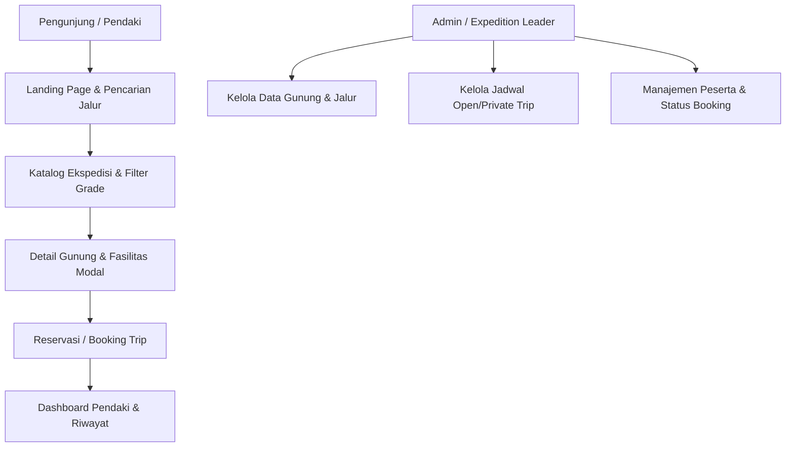

# MiddleTrip - Platform Ekspedisi & Pendakian Gunung Indonesia

> **"Jalan Tengah Menuju Puncak yang Sesungguhnya"**  
> MiddleTrip adalah platform digital ekspedisi pendakian gunung di Indonesia yang memfasilitasi layanan *Open Trip*, *Private Trip*, klasifikasi jalur pendakian terstandarisasi (*Grade A/B/C*), serta pemanduan profesional.

Dokumen ini berfungsi sebagai **panduan komprehensif bagi developer dan AI Agent** dalam merancang, mengembangkan, dan memelihara seluruh ekosistem aplikasi MiddleTrip.

---

## 1. Arsitektur & Tech Stack

Aplikasi ini dibangun menggunakan arsitektur modern berbasis ekosistem Laravel dan Docker:

| Komponen | Teknologi | Keterangan / Versi |
|---|---|---|
| **Backend Framework** | **Laravel 13** | `laravel/framework: ^13.17` |
| **Bahasa Pemrograman** | **PHP 8.5** | Runtime container Sail |
| **Containerization** | **Laravel Sail** (Docker) | Multi-container environment |
| **Database** | **MySQL 8.4** | Port `3306`, database `db_middle_trip` |
| **Database GUI** | **phpMyAdmin** | Port `8080` (Akses langsung via browser) |
| **Frontend Tooling** | **Vite 8** | `laravel-vite-plugin: ^3.1` (Port 5173) |
| **CSS Framework** | **Tailwind CSS v4** | `@tailwindcss/vite: ^4.0.0` |
| **Tipografi Utama** | **Plus Jakarta Sans** | Geometris sans-serif terstandar untuk editorial, display headings, dan seluruh antarmuka aplikasi |
| **Code Quality** | **Laravel Pint & PHPUnit 12** | Formatter & automated testing |
| **Agent Support** | **Laravel Boost** | Tooling & MCP integration untuk AI Agent |

---

## 2. Akses Layanan & Port Mapping

Ketika Laravel Sail berjalan, layanan dapat diakses melalui URL berikut:

| Layanan | URL / Port | Kredensial Default |
|---|---|---|
| **Web Application** | [http://localhost](http://localhost) (atau port 8000 jika disesuaikan) | - |
| **phpMyAdmin** | [http://localhost:8080](http://localhost:8080) | User: `sail`, Password: `password` |
| **MySQL Direct** | `localhost:3306` | DB: `db_middle_trip`, User: `sail`, Pass: `password` |
| **Vite Dev Server** | `http://localhost:5173` | Hot Module Replacement (HMR) |

---

## 3. Menjalankan Project dengan Laravel Sail

Semua perintah artisan, composer, npm, dan database **wajib** dijalankan melalui Sail agar sinkron dengan runtime container:

```bash
# Menjalankan container di background
./vendor/bin/sail up -d

# Mematikan container
./vendor/bin/sail down

# Menjalankan migrasi database
./vendor/bin/sail artisan migrate

# Menjalankan migrasi + seeder data awal
./vendor/bin/sail artisan migrate:fresh --seed

# Menjalankan dev server frontend (Tailwind & Vite HMR)
./vendor/bin/sail npm run dev

# Membangun aset bundle produksi
./vendor/bin/sail npm run build

# Menjalankan test suite
./vendor/bin/sail test
# atau
./vendor/bin/sail artisan test --compact

# Menjalankan formatting kode dengan Laravel Pint
./vendor/bin/sail pint --dirty --format agent
```

> **Alias Sail yang Disarankan:**
> Tambahkan alias ke file `.bashrc` / `.zshrc`:
> ```bash
> alias sail='[ -f sail ] && sh sail || sh vendor/bin/sail'
> ```
> Sehingga dapat dijalankan lebih ringkas: `sail artisan migrate`, `sail npm run dev`.

---

## 4. Panduan Desain & UI Sistem (DESIGN.md)

Seluruh antarmuka **harus merujuk pada spesifikasi resmi di [DESIGN.md](DESIGN.md)** dan referensi prototipe di folder `docs/referensi-interface/`:
- **Landing Page**: [`docs/referensi-interface/landingPage.html`](docs/referensi-interface/landingPage.html)
- **Katalog Ekspedisi**: [`docs/referensi-interface/katalogEkspedisi.html`](docs/referensi-interface/katalogEkspedisi.html)
- **Detail Gunung**: [`docs/referensi-interface/detail-gunung.html`](docs/referensi-interface/detail-gunung.html)

### Aturan Visual Inti:
1. **Brand Voltage & Terracotta**:
   - Warna aksen utama: **Terracotta** (`#9E3924`, hover `#862F1D`, active `#722718`).
   - Digunakan pada tombol CTA utama, harga trip, badge aktif, dan Floating Action Button (FAB chat).
2. **Alpine Deep Forest Surfaces**:
   - Bagian gelap teknis pendakian bertema hutan dataran tinggi (`#071A16`, surface `#0D2721`, border `#153A32`).
   - Dipadukan dengan pola kontur topografi (`topo-pattern`).
3. **Canvas Alami**:
   - Menggunakan `#F8F9FA` atau `#FAFAFA` (warna batu alam hangat), **jangan** gunakan abu-abu dingin korporat (`#F1F5F9`).
4. **Chromatic Grade Hierarchy (Tingkat Kesulitan)**:
   - **Grade A (Pemula / Beginner)**: Emerald (`#EAF5EF` / `#226848` / `#10B981`)
   - **Grade B (Menengah / Intermediate)**: Amber (`#FFF0E6` / `#B85320` / `#F59E0B`)
   - **Grade C (Ahli & Ekstrem / Expert)**: Rose (`#FDECEB` / `#B92F26` / `#F43F5E`)
5. **Pill / Capsule Geometry**:
   - Tombol, navbar mengambang, filter search bar, dan segmented control harus menggunakan radius `rounded-full` (`9999px`).

---

## 5. Instruksi Wajib untuk AI Agent

Bagi AI Coding Agent (Antigravity, Claude Code, Cursor, Copilot), patuhi aturan mutlak berikut:

### 1. Standar Kode & Konvensi Laravel ("The Laravel Way")
- **Gunakan Artisan CLI untuk generate file baru**:
  ```bash
  ./vendor/bin/sail artisan make:model Mountain -mfs    # Model + Migration + Factory + Seeder
  ./vendor/bin/sail artisan make:controller ExpeditionController --resource
  ./vendor/bin/sail artisan make:request StoreBookingRequest
  ```
- **PHP 8 Rules**:
  - Gunakan *Constructor Property Promotion* pada class:
    ```php
    public function __construct(
        public readonly MountainRepository $mountains,
    ) {}
    ```
  - Selalu sertakan *explicit return type* dan *type hinting* pada semua parameter method:
    ```php
    public function calculateTotal(int $paxCount, int $basePrice): int
    ```
  - Gunakan kurung kurawal `{}` untuk semua struktur kontrol (*if, for, foreach*), bahkan untuk satu baris sekalipun.
  - Gunakan *TitleCase* untuk Enum keys: `case GradeA; case GradeB; case GradeC;`.
- **Formatting**: Setiap kali mengedit file PHP, jalankan formatting kode:
  ```bash
  ./vendor/bin/sail pint --dirty --format agent
  ```

### 2. Aturan Perubahan Kode (Surgical & Simplicity First)
- **Hindari Overengineering**: Jangan membuat abstraction layer spekulatif (seperti service pattern/repository pattern yang belum dibutuhkan).
- **Surgical Edits**: Sentuh hanya file yang relevan dengan instruksi user. Jangan menghapus komentar yang ada atau mengubah kode adjacent tanpa instruksi.
- **Verifikasi Versi**: Selalu periksa `composer show --direct` dan `package.json` sebelum menggunakan API paket baru.

### 3. Integrasi Tailwind CSS v4
- Aplikasi menggunakan Tailwind v4 (`@tailwindcss/vite`).
- Konfigurasi tema token berada di [`resources/css/app.css`](resources/css/app.css) dengan directive `@theme`.
- Pastikan font Plus Jakarta Sans terhubung dengan baik di Blade layout.

---

## 6. Peta Fitur & Rencana Pengembangan



### Rencana Entitas Database Utama (Upcoming Migrations):
1. **`mountains`**: ID, nama gunung, elevasi MDPL, lokasi provinsi, deskripsi, cover image.
2. **`routes` (Jalur)**: ID, mountain_id, nama jalur, grade (`Grade A`, `Grade B`, `Grade C`), durasi jam, tingkat kesulitan, deskripsi teknis.
3. **`expeditions` (Trip)**: ID, route_id, tipe (`open_trip`, `private_trip`), tanggal berangkat, tanggal kembali, harga per pax, kuota maksimal, kuota terisi, status (`open`, `full`, `completed`, `cancelled`).
4. **`bookings`**: ID, user_id, expedition_id, jumlah_pax, total_harga, status_pembayaran (`pending`, `confirmed`, `cancelled`), catatan khusus.
5. **`facilities`**: Perlengkapan termasuk (tenda, porter tim, logistik, simaksi).

---

## 7. Struktur Direktori Kunci

```
MiddleTrip/
├── app/
│   ├── Http/Controllers/       # Controller web & API
│   ├── Models/                 # Eloquent Models (User, Mountain, Expedition, dll)
│   └── Providers/              # Service Providers
├── config/                     # Konfigurasi aplikasi
├── database/
│   ├── factories/              # Factory data testing
│   ├── migrations/             # Skema migrasi database
│   └── seeders/                # Seeder data gunung & contoh ekspedisi
├── docs/
│   ├── referensi-interface/    # Prototipe HTML (landingPage.html & katalogEkspedisi.html)
│   ├── referensi-desain.md     # Dokumen acuan format desain
│   └── ...                     # Pitchdeck & proposal
├── public/                     # Public assets & entry point
├── resources/
│   ├── css/app.css             # Tailwind v4 theme & token MiddleTrip
│   ├── js/app.js               # Entry point JavaScript
│   └── views/                  # Blade templates & components
├── routes/
│   ├── web.php                 # Web routes aplikasi
│   └── console.php             # Perintah Artisan CLI kustom
├── compose.yaml                # Definisi Docker container Sail (PHP 8.5, MySQL 8.4, phpMyAdmin)
├── DESIGN.md                   # Token, tipografi, warna, dan spesifikasi UI lengkap
└── README.md                   # Panduan developer & AI Agent (dokumen ini)
```

---

## 8. Verifikasi & Pengujian

Sebelum menandai suatu task selesai, lakukan verifikasi:
1. **Automated Test**: Jalankan `./vendor/bin/sail test`.
2. **Lint & Style**: Jalankan `./vendor/bin/sail pint --dirty --format agent`.
3. **Frontend Build**: Jalankan `./vendor/bin/sail npm run build` untuk memastikan tidak ada error pada Vite manifest.
4. **Browser Check**: Pastikan route dapat diakses tanpa error 500 dan tampilan sesuai dengan token di `DESIGN.md`.

---
*MiddleTrip Expedition Co. — Built with Laravel 13, Docker Sail & Tailwind CSS.*
