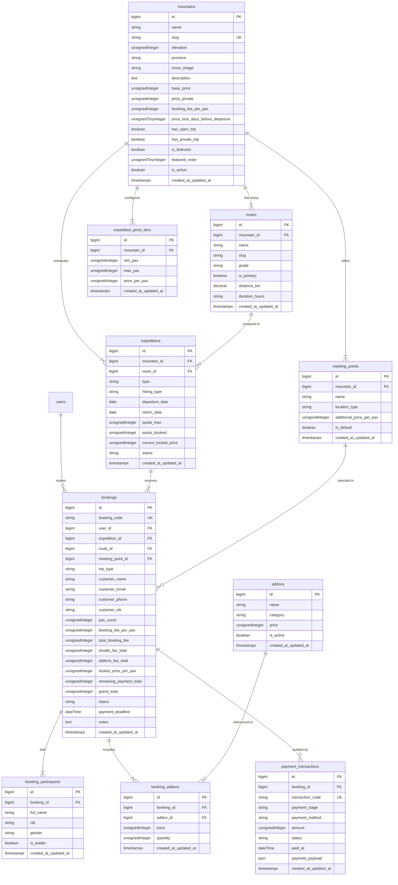

# Database Architecture & Schema Specification
# MiddleTrip — Platform Ekspedisi & Pendakian Gunung Indonesia

> **Versi Dokumen:** 1.0.0  
> **Target Database Engine:** MySQL 8.4 (LTS)  
> **Driver Framework:** Laravel 13 Eloquent ORM  
> **Collation:** `utf8mb4_unicode_ci`

---

## 1. Entity Relationship Diagram (ERD)

---

## 2. Definisi Detail Skema Tabel & Indeks

### 2.1 Tabel `mountains`
Menyimpan data master gunung, konfigurasi default, biaya DP, dan jadwal otomatis Price Lock.

| Kolom | Tipe Data | Modifiers | Keterangan |
|---|---|---|---|
| `id` | `BIGINT UNSIGNED` | `AUTO_INCREMENT, PRIMARY KEY` | ID unik gunung |
| `name` | `VARCHAR(150)` | `NOT NULL` | Nama gunung (contoh: *Mt. Merbabu*) |
| `slug` | `VARCHAR(150)` | `NOT NULL, UNIQUE` | Slug URL (contoh: *mt-merbabu*) |
| `elevation` | `INT UNSIGNED` | `NOT NULL` | Ketinggian puncak dalam MDPL |
| `province` | `VARCHAR(100)` | `NOT NULL` | Lokasi provinsi administratif |
| `cover_image` | `VARCHAR(255)` | `NOT NULL` | URL foto sampul utama |
| `description` | `TEXT` | `NULLABLE` | Deskripsi singkat editorial |
| `base_price` | `INT UNSIGNED` | `NOT NULL` | Harga display awal / patokan katalog |
| `price_private` | `INT UNSIGNED` | `NULLABLE` | Patokan awal harga private trip |
| `booking_fee_per_pax` | `INT UNSIGNED` | `NOT NULL, DEFAULT 150000` | Nilai DP per pax yang ditentukan Admin |
| `price_lock_days_before_departure` | `TINYINT UNSIGNED` | `NOT NULL, DEFAULT 3` | H-X keberangkatan saat harga batch dikunci |
| `has_open_trip` | `BOOLEAN` | `NOT NULL, DEFAULT TRUE` | Flag ketersediaan Open Trip |
| `has_private_trip` | `BOOLEAN` | `NOT NULL, DEFAULT FALSE` | Flag ketersediaan Private Trip |
| `is_featured` | `BOOLEAN` | `NOT NULL, DEFAULT FALSE` | Flag tampil di Bento Grid Homepage |
| `featured_order` | `TINYINT UNSIGNED` | `NULLABLE` | Urutan Bento Grid (1=Hero, 2, 3=Secondary) |
| `is_active` | `BOOLEAN` | `NOT NULL, DEFAULT TRUE` | Status aktif publikasi |
| `created_at` / `updated_at` | `TIMESTAMP` | `NULLABLE` | Standar timestamp Laravel |

* **Indeks**: `UNIQUE(slug)`, `INDEX(is_active, is_featured, featured_order)`.

---

### 2.2 Tabel `routes`
Menyimpan jalur-jalur pendakian resmi yang dimiliki oleh setiap gunung.

| Kolom | Tipe Data | Modifiers | Keterangan |
|---|---|---|---|
| `id` | `BIGINT UNSIGNED` | `AUTO_INCREMENT, PRIMARY KEY` | ID unik jalur |
| `mountain_id` | `BIGINT UNSIGNED` | `NOT NULL, FK -> mountains.id CASCADE` | Relasi gunung induk |
| `name` | `VARCHAR(100)` | `NOT NULL` | Nama jalur (contoh: *Via Selo*, *Via Suwanting*) |
| `slug` | `VARCHAR(100)` | `NOT NULL` | Slug jalur |
| `grade` | `VARCHAR(20)` | `NOT NULL` | Standar kesulitan: *Grade A*, *Grade B*, *Grade C* |
| `is_primary` | `BOOLEAN` | `NOT NULL, DEFAULT FALSE` | Jalur rekomendasi utama gunung |
| `distance_km` | `DECIMAL(4,1)` | `NULLABLE` | Jarak tempuh total kilometer |
| `duration_hours` | `VARCHAR(50)` | `NULLABLE` | Estimasi waktu tempuh trekking |
| `created_at` / `updated_at` | `TIMESTAMP` | `NULLABLE` | Timestamps |

* **Indeks**: `INDEX(mountain_id, is_primary)`.

---

### 2.3 Tabel `expedition_price_tiers`
Menyimpan matriks harga dinamis berundak berdasarkan akumulasi jumlah peserta.

| Kolom | Tipe Data | Modifiers | Keterangan |
|---|---|---|---|
| `id` | `BIGINT UNSIGNED` | `AUTO_INCREMENT, PRIMARY KEY` | ID unik tier harga |
| `mountain_id` | `BIGINT UNSIGNED` | `NOT NULL, FK -> mountains.id CASCADE` | Relasi gunung |
| `min_pax` | `INT UNSIGNED` | `NOT NULL` | Batas bawah jumlah peserta (misal: 1) |
| `max_pax` | `INT UNSIGNED` | `NOT NULL` | Batas atas jumlah peserta (misal: 3) |
| `price_per_pax` | `INT UNSIGNED` | `NOT NULL` | Harga per orang pada tier ini (misal: 650000) |
| `created_at` / `updated_at` | `TIMESTAMP` | `NULLABLE` | Timestamps |

* **Indeks**: `INDEX(mountain_id, min_pax, max_pax)`.

---

### 2.4 Tabel `expeditions`
Menyimpan batch jadwal keberangkatan riil (Open Trip atau Private Trip).

| Kolom | Tipe Data | Modifiers | Keterangan |
|---|---|---|---|
| `id` | `BIGINT UNSIGNED` | `AUTO_INCREMENT, PRIMARY KEY` | ID unik ekspedisi |
| `mountain_id` | `BIGINT UNSIGNED` | `NOT NULL, FK -> mountains.id CASCADE` | Relasi gunung |
| `route_id` | `BIGINT UNSIGNED` | `NOT NULL, FK -> routes.id CASCADE` | Jalur pendakian yang dilewati |
| `type` | `ENUM('open', 'private')` | `NOT NULL, DEFAULT 'open'` | Tipe ekspedisi |
| `hiking_type` | `ENUM('camping', 'tektok')`| `NOT NULL, DEFAULT 'camping'` | Camping (2D1N) atau Tek-tok (1 Day) |
| `departure_date` | `DATE` | `NOT NULL` | Tanggal mulai trekking |
| `return_date` | `DATE` | `NOT NULL` | Tanggal turun / selesai trip |
| `quota_max` | `INT UNSIGNED` | `NOT NULL` | Kuota kursi maksimal batch |
| `quota_booked` | `INT UNSIGNED` | `NOT NULL, DEFAULT 0` | Akumulasi kursi terisi yang berstatus `reserved` / `paid` |
| `current_locked_price`| `INT UNSIGNED` | `NULLABLE` | Harga final per pax setelah Price Lock terkunci |
| `status` | `ENUM('open', 'price_locked', 'completed', 'cancelled')` | `NOT NULL, DEFAULT 'open'` | Status siklus batch trip |
| `created_at` / `updated_at` | `TIMESTAMP` | `NULLABLE` | Timestamps |

* **Indeks**: `INDEX(mountain_id, departure_date, status)`.

---

### 2.5 Tabel `meeting_points`
Menyimpan titik penjemputan/kumpul beserta biaya shuttle resmi.

| Kolom | Tipe Data | Modifiers | Keterangan |
|---|---|---|---|
| `id` | `BIGINT UNSIGNED` | `AUTO_INCREMENT, PRIMARY KEY` | ID unik meeting point |
| `mountain_id` | `BIGINT UNSIGNED` | `NOT NULL, FK -> mountains.id CASCADE` | Relasi gunung |
| `name` | `VARCHAR(150)` | `NOT NULL` | Nama titik kumpul (contoh: *Basecamp Selo*) |
| `location_type` | `ENUM('basecamp', 'station', 'airport', 'terminal')` | `NOT NULL, DEFAULT 'basecamp'` | Jenis lokasi |
| `additional_price_per_pax` | `INT UNSIGNED` | `NOT NULL, DEFAULT 0` | Biaya shuttle per orang (0 jika gratis) |
| `is_default` | `BOOLEAN` | `NOT NULL, DEFAULT FALSE` | Pilihan default |
| `created_at` / `updated_at` | `TIMESTAMP` | `NULLABLE` | Timestamps |

---

### 2.6 Tabel `addons` & `booking_addons`
Menyimpan data perlengkapan sewa tambahan (*Hydropack, Trekking Pole, Matras, Headlamp*).

#### Tabel `addons`
* `id` (`BIGINT UNSIGNED, PK`)
* `name` (`VARCHAR(100), NOT NULL`)
* `category` (`VARCHAR(50), NOT NULL, DEFAULT 'gear'`)
* `price` (`INT UNSIGNED, NOT NULL`)
* `is_active` (`BOOLEAN, NOT NULL, DEFAULT TRUE`)
* `timestamps`

#### Tabel `booking_addons` (Pivot Transaksi)
* `id` (`BIGINT UNSIGNED, PK`)
* `booking_id` (`BIGINT UNSIGNED, NOT NULL, FK -> bookings.id CASCADE`)
* `addon_id` (`BIGINT UNSIGNED, NOT NULL, FK -> addons.id RESTRICT`)
* `price` (`INT UNSIGNED, NOT NULL`) $\rightarrow$ Snapshot harga saat dipesan
* `quantity` (`INT UNSIGNED, NOT NULL, DEFAULT 1`)
* `timestamps`

---

### 2.7 Tabel `bookings`
Tabel header transaksi pemesanan tiket pendakian oleh customer.

| Kolom | Tipe Data | Modifiers | Keterangan |
|---|---|---|---|
| `id` | `BIGINT UNSIGNED` | `AUTO_INCREMENT, PRIMARY KEY` | ID transaksi |
| `booking_code` | `VARCHAR(32)` | `NOT NULL, UNIQUE` | Kode unik (contoh: *MT-20260920-A1B2*) |
| `user_id` | `BIGINT UNSIGNED` | `NULLABLE, FK -> users.id SET NULL` | ID akun customer jika login |
| `expedition_id` | `BIGINT UNSIGNED` | `NOT NULL, FK -> expeditions.id RESTRICT` | Batch ekspedisi yang dipesan |
| `route_id` | `BIGINT UNSIGNED` | `NOT NULL, FK -> routes.id RESTRICT` | Jalur terpilih |
| `meeting_point_id` | `BIGINT UNSIGNED` | `NULLABLE, FK -> meeting_points.id SET NULL` | Titik kumpul terpilih |
| `trip_type` | `ENUM('open', 'private')` | `NOT NULL, DEFAULT 'open'` | Tipe pesanan |
| `customer_name` | `VARCHAR(150)` | `NOT NULL` | Nama Pemesan / Ketua Rombongan |
| `customer_email` | `VARCHAR(150)` | `NOT NULL` | Email notifikasi |
| `customer_phone` | `VARCHAR(25)` | `NOT NULL` | No WhatsApp aktif |
| `customer_nik` | `VARCHAR(20)` | `NOT NULL` | NIK KTP Ketua Pemesan |
| `pax_count` | `TINYINT UNSIGNED` | `NOT NULL` | Jumlah tiket / kursi dipesan |
| `booking_fee_per_pax` | `INT UNSIGNED` | `NOT NULL` | Snapshot DP per pax saat transaksi dibuat |
| `total_booking_fee` | `INT UNSIGNED` | `NOT NULL` | Wajib dibayar di awal: `pax * booking_fee_per_pax` |
| `shuttle_fee_total` | `INT UNSIGNED` | `NOT NULL, DEFAULT 0` | Ditagih saat Price Lock |
| `addons_fee_total` | `INT UNSIGNED` | `NOT NULL, DEFAULT 0` | Ditagih saat Price Lock |
| `locked_price_per_pax` | `INT UNSIGNED` | `NULLABLE` | Harga tiering final setelah Price Lock |
| `remaining_payment_total`| `INT UNSIGNED` | `NULLABLE` | Tagihan sisa pelunasan di fase 3 |
| `grand_total` | `INT UNSIGNED` | `NOT NULL` | Akumulasi total biaya keseluruhan trip |
| `status` | `ENUM('open', 'reserved', 'price_locked', 'paid', 'expired', 'cancelled')` | `NOT NULL, DEFAULT 'open'` | Siklus status booking |
| `payment_deadline` | `DATETIME` | `NULLABLE` | Batas waktu pelunasan 48 jam saat price locked |
| `notes` | `TEXT` | `NULLABLE` | Catatan khusus pendaki |
| `created_at` / `updated_at` | `TIMESTAMP` | `NULLABLE` | Timestamps |

* **Indeks**: `UNIQUE(booking_code)`, `INDEX(expedition_id, status)`, `INDEX(customer_phone)`.

---

### 2.8 Tabel `booking_participants`
Menyimpan data identitas resmi seluruh pendaki yang didaftarkan dalam satu booking (wajib untuk SIMAKSI & Asuransi).

| Kolom | Tipe Data | Modifiers | Keterangan |
|---|---|---|---|
| `id` | `BIGINT UNSIGNED` | `AUTO_INCREMENT, PRIMARY KEY` | ID peserta |
| `booking_id` | `BIGINT UNSIGNED` | `NOT NULL, FK -> bookings.id CASCADE` | ID booking induk |
| `full_name` | `VARCHAR(150)` | `NOT NULL` | Nama lengkap sesuai KTP |
| `nik` | `VARCHAR(20)` | `NOT NULL` | NIK 16 digit KTP resmi |
| `gender` | `ENUM('L', 'P')` | `NULLABLE` | Jenis kelamin |
| `is_leader` | `BOOLEAN` | `NOT NULL, DEFAULT FALSE` | Penanda Ketua Rombongan |
| `created_at` / `updated_at` | `TIMESTAMP` | `NULLABLE` | Timestamps |

* **Indeks**: `INDEX(booking_id, is_leader)`.

---

### 2.9 Tabel `payment_transactions`
Audit trail seluruh pembayaran yang masuk (DP maupun Pelunasan).

| Kolom | Tipe Data | Modifiers | Keterangan |
|---|---|---|---|
| `id` | `BIGINT UNSIGNED` | `AUTO_INCREMENT, PRIMARY KEY` | ID transaksi bayar |
| `booking_id` | `BIGINT UNSIGNED` | `NOT NULL, FK -> bookings.id CASCADE` | Relasi booking |
| `transaction_code` | `VARCHAR(50)` | `NOT NULL, UNIQUE` | Kode transaksi payment gateway / bank |
| `payment_stage` | `ENUM('booking_fee', 'settlement', 'full_payment')` | `NOT NULL` | Tahap pembayaran |
| `payment_method` | `VARCHAR(50)` | `NOT NULL` | BCA VA, Mandiri VA, QRIS, Manual TF |
| `amount` | `INT UNSIGNED` | `NOT NULL` | Nominal dibayarkan |
| `status` | `ENUM('pending', 'success', 'failed', 'expired')` | `NOT NULL, DEFAULT 'pending'` | Status transaksi |
| `paid_at` | `DATETIME` | `NULLABLE` | Waktu keberhasilan pembayaran |
| `payment_payload` | `JSON` | `NULLABLE` | Respon webhook payload dari gateway |
| `created_at` / `updated_at` | `TIMESTAMP` | `NULLABLE` | Timestamps |

---

## 3. Relasi Eloquent Models

### Model `Mountain`
* `hasMany(Route::class)`
* `hasOne(Route::class)->where('is_primary', true)` $\rightarrow$ `primaryRoute`
* `hasMany(ExpeditionPriceTier::class)`
* `hasMany(Expedition::class)`
* `hasMany(MeetingPoint::class)`

### Model `Expedition`
* `belongsTo(Mountain::class)`
* `belongsTo(Route::class)`
* `hasMany(Booking::class)`

### Model `Booking`
* `belongsTo(Expedition::class)`
* `belongsTo(Route::class)`
* `belongsTo(MeetingPoint::class)`
* `belongsTo(User::class)`
* `hasMany(BookingParticipant::class)`
* `belongsToMany(Addon::class, 'booking_addons')->withPivot('price', 'quantity')`
* `hasMany(PaymentTransaction::class)`
