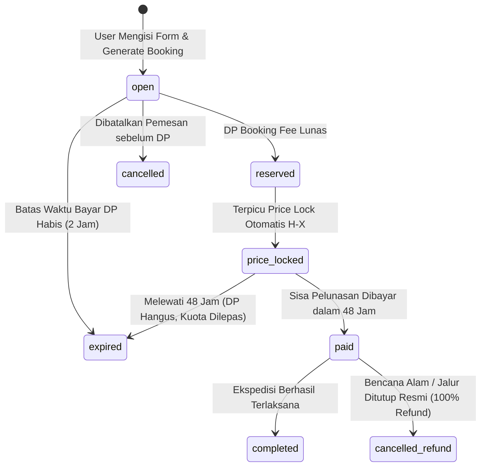
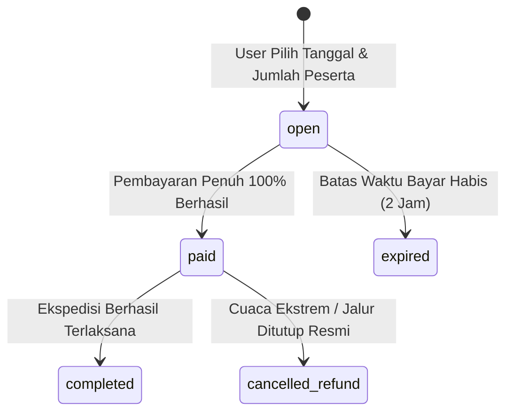

# System Business Logic & Workflow Specification
# MiddleTrip — Platform Ekspedisi & Pendakian Gunung Indonesia

> **Versi Dokumen:** 1.0.0  
> **Status:** Living Document / Active Business Logic Specification  
> **Target Audiens:** AI Coding Agents, Software Engineers, Product Operations  
> **Kaitan Dokumen:** [`docs/PRD.md`](PRD.md) • [`docs/database.md`](database.md)

---

## 1. Ikhtisar Logika Inti Sistem

Sistem MiddleTrip mengintegrasikan **3 pilar logika utama**:
1. **Dynamic Tiering Pricing Engine**: Menghitung harga per pax secara dinamis berbanding lurus dengan skala jumlah peserta.
2. **4-Stage Booking State Machine (Open Trip)**: Mengelola siklus hidup transaksi dari komitmen awal (DP) hingga pelunasan berbasis *Price Lock*.
3. **Automated Batch Processing & Expiry**: Otomatisasi penguncian harga H-X dan pembatalan pesanan yang melewati batas waktu pelunasan 48 jam.

---

## 2. Logika Matematika & Rumus Perhitungan Harga

### 2.1 Algoritma Pencocokan Matriks Harga Dinamis (*Price Tier Matcher*)
Ketika sistem perlu menentukan harga per pax suatu ekspedisi dengan akumulasi peserta sebanyak $N$ orang:

$$\text{Pilih } \text{tier} \in \text{expedition\_price\_tiers} \quad \text{di mana} \quad \text{tier.min\_pax} \le N \le \text{tier.max\_pax}$$

* **Fallback Logic**: Jika $N > \max(\text{tier.max\_pax})$, sistem mengambil harga tier dengan `max_pax` tertinggi (harga termurah).
* **Contoh Data Tier Mt. Merbabu**:
  * Tier 1: $1 - 3 \text{ pax} \rightarrow \text{Rp } 650.000$
  * Tier 2: $4 - 6 \text{ pax} \rightarrow \text{Rp } 550.000$
  * Tier 3: $7 - 10 \text{ pax} \rightarrow \text{Rp } 475.000$

---

### 2.2 Alur Perhitungan Open Trip (4 Tahap)

#### Tahap 1: Booking Fee (DP) saat Reservasi Awal
Biaya DP bertujuan mengamankan kuota dan verifikasi komitmen pendaki:

$$\mathbf{Total\ DP} = \text{pax\_count} \times \text{mountain.booking\_fee\_per\_pax}$$

* **Catatan**: Biaya Shuttle dan Add-ons **tidak** ditagihkan di awal, melainkan dimasukkan ke tagihan pelunasan saat Price Lock.
* **Contoh Kasus**: Pemesan mendaftarkan 3 orang untuk Mt. Merbabu (`booking_fee_per_pax = Rp 150.000`).
  $$\text{Total DP} = 3 \times \text{Rp } 150.000 = \mathbf{Rp\ 450.000}$$

---

#### Tahap 2: Masa Tunggu Batch (*Reserved State*)
* Status Booking: `reserved`.
* Akumulasi kuota ekspedisi bertambah:
  $$\text{expeditions.quota\_booked} = \text{expeditions.quota\_booked} + \text{pax\_count}$$
* Kuota tersisa yang dapat dipesan user lain:
  $$\text{Slot Tersedia} = \text{expeditions.quota\_max} - \text{expeditions.quota\_booked}$$

---

#### Tahap 3: Price Lock Otomatis & Tagihan Sisa Pelunasan
Terpicu saat:
$$\text{Hari Ini} \ge \text{expeditions.departure\_date} - \text{mountain.price_lock_days_before_departure}$$

1. **Kunci Harga Final**: Ambil total pendaftar di batch tersebut ($N = \text{expeditions.quota\_booked}$). Cocokkan dengan `expedition_price_tiers` untuk memperoleh $\mathbf{P_{\text{final}}}$ (`locked_price_per_pax`).
2. **Kalkulasi Biaya Shuttle**:
   $$\text{Total Shuttle} = \text{pax\_count} \times \text{meeting\_point.additional\_price\_per\_pax}$$
3. **Kalkulasi Biaya Add-ons (Sewa Alat)**:
   $$\text{Total Addons} = \sum (\text{addon.price} \times \text{quantity})$$
4. **Hitung Grand Total Biaya Ekspedisi**:
   $$\text{Grand Total} = (\text{pax\_count} \times \mathbf{P_{\text{final}}}) + \text{Total Shuttle} + \text{Total Addons}$$
5. **Hitung Sisa Pelunasan Wajib**:
   $$\mathbf{Sisa\ Pelunasan} = \text{Grand Total} - \text{Total DP yang Sudah Dibayar}$$
6. **Batas Waktu Pelunasan**:
   $$\text{payment\_deadline} = \text{Waktu Price Lock} + 48\ \text{Jam}$$

* **Simulasi Nyata**:
  * 3 peserta di Mt. Merbabu.
  * Total peserta batch terkumpul: 6 orang $\rightarrow$ Harga terkunci di Tier 2: **Rp 475.000/pax**.
  * Shuttle Solo Balapan: $3 \times \text{Rp } 75.000 = \text{Rp } 225.000$.
  * Sewa 1 Hydropack: $\text{Rp } 15.000$.
  * $\text{Grand Total} = (3 \times 475.000) + 225.000 + 15.000 = \text{Rp } 1.665.000$.
  * $\text{Sisa Pelunasan} = \text{Rp } 1.665.000 - \text{Rp } 450.000 = \mathbf{Rp\ 1.215.000}$.

---

#### Tahap 4: Pelunasan Berhasil (*Paid / Closed State*)
* Status Booking diupdate menjadi: `paid`.
* E-Tiket dan Kode Registrasi SIMAKSI diterbitkan.
* Link grup WhatsApp koordinasi resmi ditampilkan kepada pemesan.

---

### 2.3 Alur Perhitungan Private Trip (Direct 100% Upfront)
Pada Private Trip, tanggal keberangkatan dipilih bebas oleh pemesan, dan rombongan tidak digabung dengan pendaki lain.

1. **Penentuan Harga**: Karena jumlah peserta rombongan sudah pasti ($N = \text{pax\_count}$), harga per pax langsung menggunakan tier $N$ orang dari `expedition_price_tiers`.
2. **Kalkulasi Pembayaran Penuh 100%**:
   $$\mathbf{Total\ Bayar} = (\text{pax\_count} \times \text{tier\_price}) + (\text{pax\_count} \times \text{shuttle\_price}) + \text{Total Addons}$$
3. **Pembayaran Langsung**: Pemesan membayar $100\%$ nominal di muka.
4. **Hasil**: Status langsung menjadi `paid`, jadwal di-booking khusus, dan pemandu private dialokasikan.

---

## 3. Diagram State Machine Transaksi (Status Lifecycle)

### 3.1 State Machine Pemesanan Open Trip



### 3.2 State Machine Pemesanan Private Trip



---

## 4. Penanganan Edge Cases & Pengecualian Sistem

### 4.1 Kuota Tersisa dan Race Condition (Pessimistic Locking)
* **Masalah**: Sisa 1 slot, namun ada 2 user yang bersamaan klik tombol bayar.
* **Solusi**:
  Gunakan transaksi database dengan `lockForUpdate()` di Laravel Service:
  ```php
  DB::transaction(function () use ($expeditionId, $paxCount) {
      $expedition = Expedition::where('id', $expeditionId)->lockForUpdate()->first();
      
      if (($expedition->quota_max - $expedition->quota_booked) < $paxCount) {
          throw new InsufficientQuotaException("Slot kuota tidak mencukupi.");
      }
      
      // Proses booking dan amankan slot
      $expedition->increment('quota_booked', $paxCount);
  });
  ```

---

### 4.2 Batas Minimal Keberangkatan (*Unconditional Departure*)
* **Aturan Mutlak**: Tidak ada batas minimum kuota pendaftar.
* **Skenario**: Hanya ada 1 orang pendaftar hingga H-X Price Lock.
* **Tindakan Sistem**:
  * Sistem tetap mengunci harga pada Tier 1 orang (misal Rp 650.000).
  * Trip **tetap diberangkatkan** secara profesional oleh MiddleTrip.

---

### 4.3 Kegagalan Pelunasan dalam 48 Jam (*Expired Policy*)
* **Skenario**: Booking telah berstatus `price_locked`, namun pemesan tidak melunasi hingga `payment_deadline` berakhir.
* **Tindakan Sistem**:
  1. Command harian/hourly mengubah status booking menjadi `expired`.
  2. Nilai DP (`total_booking_fee`) **hangus** (non-refundable) sebagai biaya komitmen logistik.
  3. Kuota dikembalikan ke ekspedisi:
     $$\text{expeditions.quota\_booked} = \text{expeditions.quota\_booked} - \text{booking.pax\_count}$$
  4. Pengguna dikeluarkan dari daftar manifes SIMAKSI.

---

### 4.4 Pembatalan Akibat Bencana Alam / Penutupan Jalur Resmi
* **Skenario**: Jalur pendakian ditutup oleh Balai Taman Nasional akibat erupsi vulkanik atau badai ekstrem.
* **Tindakan Sistem**:
  1. Admin mengubah status ekspedisi menjadi `cancelled`.
  2. Seluruh booking berstatus `reserved` maupun `paid` otomatis berstatus `cancelled_refund`.
  3. Hak pengembalian dana 100% (termasuk DP) diproses ke rekening pemesan.

---

## 5. Validasi Data Masukan (Validation Rules)

### 5.1 Validasi Form Reservasi Awal (`StoreBookingRequest`)
* `customer_name`: `required|string|min:3|max:150`
* `customer_email`: `required|email|max:150`
* `customer_phone`: `required|string|regex:/^([0-9\s\-\+\(\)]*)$/|min:9|max:20`
* `customer_nik`: `required|digits:16` (KTP Indonesia standar)
* `pax_count`: `required|integer|min:1|max:10`
* `participants`: `required|array|size:pax_count`
* `participants.*.full_name`: `required|string|min:3|max:150`
* `participants.*.nik`: `required|digits:16` (Wajib untuk setiap peserta rombongan demi SIMAKSI & asuransi)
* `meeting_point_id`: `nullable|exists:meeting_points,id`
* `addons`: `nullable|array`
* `addons.*.id`: `required|exists:addons,id`
* `addons.*.quantity`: `required|integer|min:1`

---

## 6. Otomatisasi Artisan CLI & Scheduled Jobs

### 6.1 `expeditions:process-price-locks`
* **Jadwal**: Dijalankan setiap hari pukul `00:01 WIB`.
* **Tugas**:
  1. Mengambil seluruh ekspedisi `open` yang mencapai batas H-X (`departure_date - price_lock_days_before_departure <= today()`).
  2. Menentukan harga tier berdasarkan total `quota_booked`.
  3. Mengunci harga dan menghitung sisa pelunasan untuk setiap booking `reserved`.
  4. Menetapkan `payment_deadline = now()->addHours(48)`.
  5. Mengirimkan notifikasi WhatsApp invoice pelunasan ke setiap pemesan.

### 6.2 `bookings:expire-unpaid`
* **Jadwal**: Dijalankan setiap 1 jam.
* **Tugas**:
  1. Mengambil booking `price_locked` dengan `payment_deadline < now()`.
  2. Mengubah status menjadi `expired` dan mengembalikan kuota kursi.

---

## 7. Format Notifikasi Pesan WhatsApp

### 7.1 Notifikasi Reservasi Berhasil (Fase 1)
```
Halo [Nama Pemesan],

Booking ekspedisi MiddleTrip Anda berhasil diamankan!
• Kode Booking: MT-20260920-ABCD
• Ekspedisi: Mt. Merbabu (Via Selo)
• Tanggal: 20 September 2026
• Jumlah Peserta: 2 Orang
• DP Dibayar: Rp 300.000 (Lunas)

Harga final akan ditentukan saat pendaftaran ditutup (H-3). Silakan bergabung ke grup koordinasi berikut:
👉 https://chat.whatsapp.com/MiddleTripMerbabu
```

### 7.2 Notifikasi Price Lock & Invoice Pelunasan (Fase 3)
```
Halo [Nama Pemesan],

Harga ekspedisi Mt. Merbabu resmi DIKUNCI!
Karena batch Anda terkumpul 6 peserta, harga turun menjadi Rp 475.000/orang!

Rincian Pelunasan Anda:
• Total Biaya: Rp 1.175.000
• DP Awal: -Rp 300.000
• Sisa Pelunasan: Rp 875.000

Batas Waktu Pelunasan: 48 Jam (s.d. [Tanggal & Jam]).
Silakan lakukan pelunasan melalui tautan resmi berikut:
👉 https://middletrip.id/checkout/MT-20260920-ABCD/status
```
