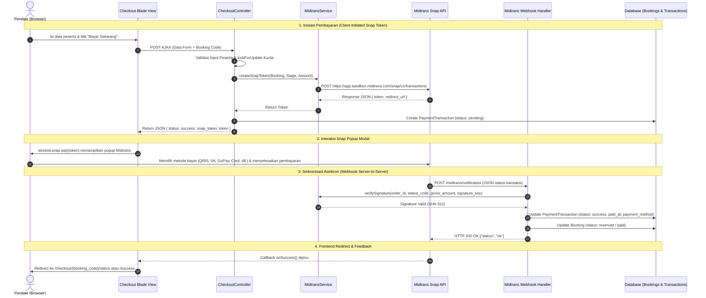

# Design Specification: Midtrans Snap Payment Gateway Integration
# MiddleTrip — Platform Ekspedisi & Pendakian Gunung Indonesia

> **Tanggal:** 2026-10-01  
> **Status:** Approved / Active Specification  
> **Target Subsystem:** Payment Gateway, Checkout Flow, Webhook Notification  
> **Referensi Resmi:** [Midtrans Snap API Overview](https://docs.midtrans.com/reference/snap-api-overview) • [Snap Integration Guide](https://docs.midtrans.com/docs/snap-snap-integration-guide) • [HTTP Notification Webhooks](https://docs.midtrans.com/docs/https-notification-webhooks)

---

## 1. Ringkasan Eksekutif & Tujuan

Sebelumnya, transaksi pembayaran pada MiddleTrip menggunakan metode mock/hardcode (radio button statis dan update status instan tanpa validasi payment gateway). Spesifikasi ini mendefinisikan transformasi menyeluruh seluruh alur pembayaran MiddleTrip menjadi integrasi resmi **Midtrans Sandbox** menggunakan antarmuka **Snap Popup Modal** dan verifikasi server-to-server **HTTP Notification (Webhook)** berbasis hash signature SHA-512.

Kebutuhan integrasi ini mencakup:
1. Menghilangkan seluruh kode metode pembayaran hardcoded pada database, controller, dan tampilan blade.
2. Mengintegrasikan Midtrans Snap API menggunakan native Laravel HTTP Client (`Illuminate\Support\Facades\Http`) tanpa library pihak ketiga yang rentan usang.
3. Mendukung ketiga siklus pembayaran MiddleTrip:
   - **Tahap 1**: Pembayaran Booking Fee (DP) Open Trip.
   - **Tahap 3**: Pelunasan Sisa Biaya (Settlement) Open Trip pasca Price Lock.
   - **Private Trip**: Pembayaran Langsung 100% Penuh di Muka (Full Payment).
4. Menjamin kesiapan pakai: Pemilik website hanya perlu memasukkan `MIDTRANS_SERVER_KEY` dan `MIDTRANS_CLIENT_KEY` di file `.env`.

---

## 2. Arsitektur Sistem & Data Flow



---

## 3. Spesifikasi Detail Komponen

### 3.1 Konfigurasi Lingkungan (`config/midtrans.php`)

Variabel konfigurasi disimpan di `config/midtrans.php`:
```php
return [
    'server_key' => env('MIDTRANS_SERVER_KEY', ''),
    'client_key' => env('MIDTRANS_CLIENT_KEY', ''),
    'is_production' => (bool) env('MIDTRANS_IS_PRODUCTION', false),
    'is_sanitized' => (bool) env('MIDTRANS_IS_SANITIZED', true),
    'is_3ds' => (bool) env('MIDTRANS_IS_3DS', true),

    'snap_url' => env('MIDTRANS_IS_PRODUCTION', false)
        ? 'https://app.midtrans.com/snap/snap.js'
        : 'https://app.sandbox.midtrans.com/snap/snap.js',

    'snap_api_url' => env('MIDTRANS_IS_PRODUCTION', false)
        ? 'https://app.midtrans.com/snap/v1/transactions'
        : 'https://app.sandbox.midtrans.com/snap/v1/transactions',

    'core_api_url' => env('MIDTRANS_IS_PRODUCTION', false)
        ? 'https://api.midtrans.com/v2'
        : 'https://api.sandbox.midtrans.com/v2',
];
```

Entri baru di `.env` dan `.env.example`:
```env
MIDTRANS_SERVER_KEY=
MIDTRANS_CLIENT_KEY=
MIDTRANS_IS_PRODUCTION=false
MIDTRANS_IS_SANITIZED=true
MIDTRANS_IS_3DS=true
```

---

### 3.2 Service Layer: `App\Services\MidtransService`

Class `MidtransService` bertanggung jawab atas semua interaksi HTTP ke API Midtrans:

1. **`createSnapToken(Booking $booking, string $paymentStage, int $amount): array`**:
   - Menghasilkan format `order_id` unik:
     - DP Open Trip: `MT-DP-{$booking->id}-{$timestamp}`
     - Pelunasan Open Trip: `MT-SETTLE-{$booking->id}-{$timestamp}`
     - Private Trip: `MT-PVT-{$booking->id}-{$timestamp}`
   - Menyiapkan payload API:
     ```json
     {
       "transaction_details": {
         "order_id": "MT-DP-1-1727771234",
         "gross_amount": 300000
       },
       "customer_details": {
         "first_name": "Arkan Isa",
         "email": "arkan@example.com",
         "phone": "08123456789"
       },
       "item_details": [
         {
           "id": "BOOKING-FEE-MT-MERBABU",
           "price": 150000,
           "quantity": 2,
           "name": "Booking Fee (DP) Mt. Merbabu"
         }
       ],
       "credit_card": {
         "secure": true
       }
     }
     ```
   - Mengirim request `POST` ke `config('midtrans.snap_api_url')` dengan header `Authorization: Basic {base64(server_key . ':')}` dan `Accept: application/json`.
   - Mengembalikan array: `['token' => $token, 'redirect_url' => $redirectUrl, 'order_id' => $orderId]`.

2. **`verifySignature(string $orderId, string $statusCode, string $grossAmount, string $signatureKey): bool`**:
   - Menghitung SHA-512:
     $$\text{computedHash} = \text{hash}(\text{'sha512'}, \text{order\_id} . \text{status\_code} . \text{gross\_amount} . \text{server\_key})$$
   - Menggunakan `hash_equals($computedHash, $signatureKey)` untuk perlindungan *timing attack*.

3. **`processNotification(array $payload): array`**:
   - Mengurai `order_id`, `transaction_status`, `fraud_status`, dan `payment_type`.
   - Menentukan status akhir transaksi: `success`, `pending`, `failed`, atau `expired`.

---

### 3.3 Controller Updates (`CheckoutController` & `MidtransNotificationController`)

#### 1. Endpoint Webhook: `MidtransNotificationController@handle`
- **Route**: `POST /midtrans/notification` (diberi nama `midtrans.notification`).
- **CSRF Bypass**: Dikecualikan di `bootstrap/app.php`:
  ```php
  $middleware->validateCsrfTokens(except: [
      'midtrans/notification',
  ]);
  ```
- **Logika**:
  1. Terima payload JSON.
  2. Verifikasi keabsahan signature menggunakan `MidtransService::verifySignature()`. Jika tidak valid, kembalikan HTTP 403 Forbidden.
  3. Cari record `PaymentTransaction` berdasarkan `transaction_code` (`order_id`).
  4. Perbarui status:
     - Jika status `settlement` (atau `capture` dengan `fraud_status === 'accept'`):
       - `PaymentTransaction`: `status = 'success'`, `paid_at = now()`, `payment_method = $payload['payment_type']`, `payment_payload = $payload`.
       - `Booking`:
         - Jika stage `booking_fee` $\rightarrow$ update status ke `'reserved'`.
         - Jika stage `settlement` atau `full_payment` $\rightarrow$ update status ke `'paid'`.
     - Jika status `pending`:
       - `PaymentTransaction`: `status = 'pending'`, simpan payload.
     - Jika status `deny`, `cancel`, `expire`, `failure`:
       - `PaymentTransaction`: `status = 'failed'` (atau `'expired'`).
  5. Kembalikan HTTP 200 `['status' => 'ok']`.

#### 2. Endpoint Pembuatan Token di `CheckoutController`
- `payDp`: Memvalidasi form peserta, meminta snap token dari `MidtransService`, mencatat `PaymentTransaction` pending, dan mengembalikan JSON `{ status: 'success', snap_token: $token, order_id: $orderId }`.
- `settle`: Memvalidasi status `price_locked`, meminta snap token senilai `remaining_payment_total`, mencatat `PaymentTransaction` pending, dan mengembalikan JSON.
- `payPrivate`: Memvalidasi form rombongan, meminta snap token senilai `grand_total`, mencatat `PaymentTransaction` pending, dan mengembalikan JSON.

---

### 3.4 Antarmuka Pengguna (Blade Views)

1. **`resources/views/customer/checkout/step1_payment.blade.php`**:
   - Memuat `<script src="{{ config('midtrans.snap_url') }}" data-client-key="{{ config('midtrans.client_key') }}"></script>`.
   - Mengganti pilihan radio button hardcoded dengan kartu saluran pembayaran resmi Midtrans Snap berdesain modern (Plus Jakarta Sans, capsule badge, warna Terracotta).
   - Menambahkan JavaScript handler pada tombol bayar:
     - Validasi form HTML5.
     - Mengubah state tombol menjadi *loading/disabled*.
     - Melakukan `fetch()` POST ke route `checkout.pay_dp`.
     - Membuka popup `window.snap.pay(snapToken, callbacks)`.
     - Callback `onSuccess` langsung melakukan redirect ke `route('checkout.status', $booking->booking_code)`.

2. **`resources/views/customer/checkout/step2_status.blade.php`**:
   - Memuat script `snap.js`.
   - Menghubungkan tombol pelunasan di status `price_locked` dengan AJAX request ke `checkout.settle` dan membuka `window.snap.pay()`.
   - Callback `onSuccess` mengarahkan ke `route('checkout.success', $booking->booking_code)`.

3. **`resources/views/customer/checkout/private_payment.blade.php`**:
   - Memuat script `snap.js`.
   - Mengganti radio button statis dengan info card Midtrans Snap.
   - Menghubungkan form submit dengan `checkout.pay_private` dan membuka `window.snap.pay()`.
   - Callback `onSuccess` mengarahkan ke `route('checkout.success', $booking->booking_code)`.

---

## 4. Keamanan & Penanganan Edge Cases

1. **Keamanan Signature Hash**:
   - Setiap webhook diverifikasi dengan SHA-512 menggunakan `ServerKey` rahasia.
   - Serangan pemalsuan callback atau replay attack dicegah karena status hanya berubah jika signature valid dan order_id cocok.
2. **Double Payment & Idempotency**:
   - Jika webhook berulang kali diterima untuk transaksi yang sama dan sudah berstatus `success`, sistem tidak akan menduplikasi kuota atau transaksi.
3. **Pessimistic Locking**:
   - Tetap menggunakan `lockForUpdate()` pada batch ekspedisi untuk memastikan kuota tidak terlampaui saat banyak peserta memesan bersamaan.
4. **Fallback Tanpa Credentials**:
   - Jika `MIDTRANS_SERVER_KEY` belum diisi di `.env`, controller mengembalikan error ramah: *"Midtrans Server Key belum dikonfigurasi pada file .env"*.

---

## 5. Strategi Pengujian (Automated Test Suite)

1. **Unit / Feature Test `MidtransService`**:
   - Memverifikasi pembuatan payload transaksi dan Snap Token menggunakan `Http::fake()`.
   - Menguji kebenaran algoritma verifikasi signature SHA-512.
2. **Feature Test `CheckoutController`**:
   - Menguji bahwa request POST ke `checkout.pay_dp`, `checkout.settle`, dan `checkout.pay_private` mengembalikan response JSON berisi `snap_token` yang valid.
3. **Feature Test Webhook (`MidtransNotificationController`)**:
   - Menguji webhook valid dengan status `settlement` mengubah status transaksi dan booking menjadi `reserved` / `paid`.
   - Menguji webhook palsu (signature salah) ditolak dengan HTTP 403.
   - Menguji webhook `expire` / `cancel` menandai transaksi gagal.

---

Dokumen spesifikasi ini telah ditinjau dan siap dijadikan acuan pembuatan rencana implementasi (*implementation plan*).
